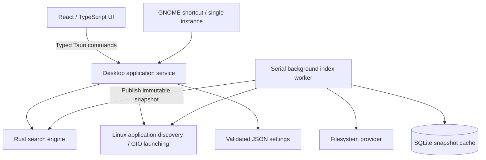

# Architecture

## Target and scope

Ubuntu desktop launcher: show on a shortcut, search installed applications and selected file/folder names, and open the selected result. The first release targets Ubuntu 24.04 with GNOME, with X11 as the primary validation environment. Wayland uses a GNOME custom shortcut invoking the single-instance executable; focus behavior remains compositor-controlled.

## Boundaries

| Location                | Responsibility                                                            | Must not own                                     |
| ----------------------- | ------------------------------------------------------------------------- | ------------------------------------------------ |
| `crates/spotlight-core` | Models, validated configuration, file traversal, ranking, persistence     | Windows, React, arbitrary command execution      |
| `src-tauri/src`         | Application lifecycle, IPC commands, Linux adapters, worker orchestration | UI presentation                                  |
| `src`                   | Search state, keyboard interaction, results, settings, theme              | Filesystem traversal, desktop executable parsing |

The core does not depend on Tauri or a running display server. It can be reused by a future CLI and tested independently. Application discovery and launch use Linux GIO so desktop-entry quoting, Flatpak/Snap integration, and terminal applications follow desktop behavior.

The desktop icon adapter resolves GIO application/MIME icons through GTK's active icon theme. Only visible results request icons. A bounded cache holds up to 256 rendered 64-pixel PNGs; the frontend gets data URIs, with no filesystem capability. File MIME guesses use the filename without reading file contents. Missing icons use type-specific frontend fallbacks.

## Search and indexing

Index selected roots in a worker, skipping hidden/build/dependency directories by default. Do not follow symlinks. Deduplicate overlapping roots. Cap traversal depth and indexed entries, and expose truncation and read errors rather than silently claiming complete coverage.

Publish a complete immutable index through a short-held lock. Searches keep their own reference to the snapshot, so disk traversal never blocks a query. Normalize names once per index, rank exact/prefix/substring/subsequence matches, and return a bounded result list. File contents are not indexed.

Keep a SQLite snapshot for warm starts. Replace cached rows in one transaction and associate them with the relevant settings. Ignore a cache from a different configuration. Refresh after startup, on explicit request, and after filesystem changes. Filesystem monitoring is a separate adapter, not search logic. A bounded channel coalesces changes; access-only events are ignored. Watch up to 8,192 discovered directories without recursively watching excluded dependency/build trees. The current worker rebuilds a bounded snapshot; true incremental updates remain future work.

Serialize index jobs. Coalesce refresh requests; configuration revisions prevent an obsolete scan from publishing after the user changes roots. The frontend debounces queries and rejects late replies. Never launch an item from results belonging to an earlier query.

## Settings and customization

Use XDG config/cache locations. Validate roots, result limits, traversal limits, shortcut syntax, themes, and accent colors at the boundary. Write settings using a temporary file and atomic rename. Expose theme, accent, density, shortcut, roots, exclusions, and search limits. A settings form is the initial extension surface; arbitrary plugins and scripts require a separate design.

## Desktop lifecycle

Keep one application process running while the search window is hidden. Escape hides; the explicit Quit action exits. Reinvoking `spotlight --toggle` toggles the existing window. Use the global shortcut plugin on X11; use GNOME's custom shortcut facility on Wayland. Startup and shortcut failures are visible and actionable, not fatal to search.

GNOME reserves Super+Space for input-source switching by default. The application documents reassignment and does not silently overwrite desktop settings. [GNOME documentation](https://help.gnome.org/gnome-help/keyboard-layouts.html). The upstream hotkey library currently supports Linux X11 only. [Upstream support](https://github.com/tauri-apps/global-hotkey).

## Safety and reliability

- The frontend requests launch by indexed ID. Rust resolves it against the current index; it does not accept arbitrary shell text.
- Open paths through GIO's default application handler. Launch installed apps through their desktop IDs.
- Revalidate file paths against active roots at launch time, including symlink resolution.
- Keep IPC local and use a restrictive Content Security Policy. No remote page loading, telemetry, or hosted service.
- Report malformed settings, database failures, inaccessible roots, watcher limits, and shortcut conflicts to the UI.
- Preserve a usable in-memory index if persistence or a later scan fails.

## Verification and release criteria

Core tests cover ranking, filtering, Unicode, traversal exclusions, root validation, SQLite replacement, and cache invalidation. Frontend checks cover stale asynchronous results and keyboard interaction. CI runs type checking, frontend build, Rust tests, formatting, and Clippy on Ubuntu. Native smoke tests validate the installed environment separately.

Measure warm query latency against a 50,000-entry synthetic index and record the environment and build profile; do not substitute that for real filesystem benchmarks. Before a production release, measure p50/p95 query and show-to-focus latency, startup time, idle RSS/CPU, index time and memory, and battery impact on supported hardware.

Remaining release gates include sustained filesystem churn, multiple monitors/scaling, input methods and accessibility, Wayland focus and shortcut testing, upgrade/migration and corrupt-cache recovery, and packaged `.deb` installation tests. Extensions, file-content search, and million-file indexing are later features, not claims of the first version.
